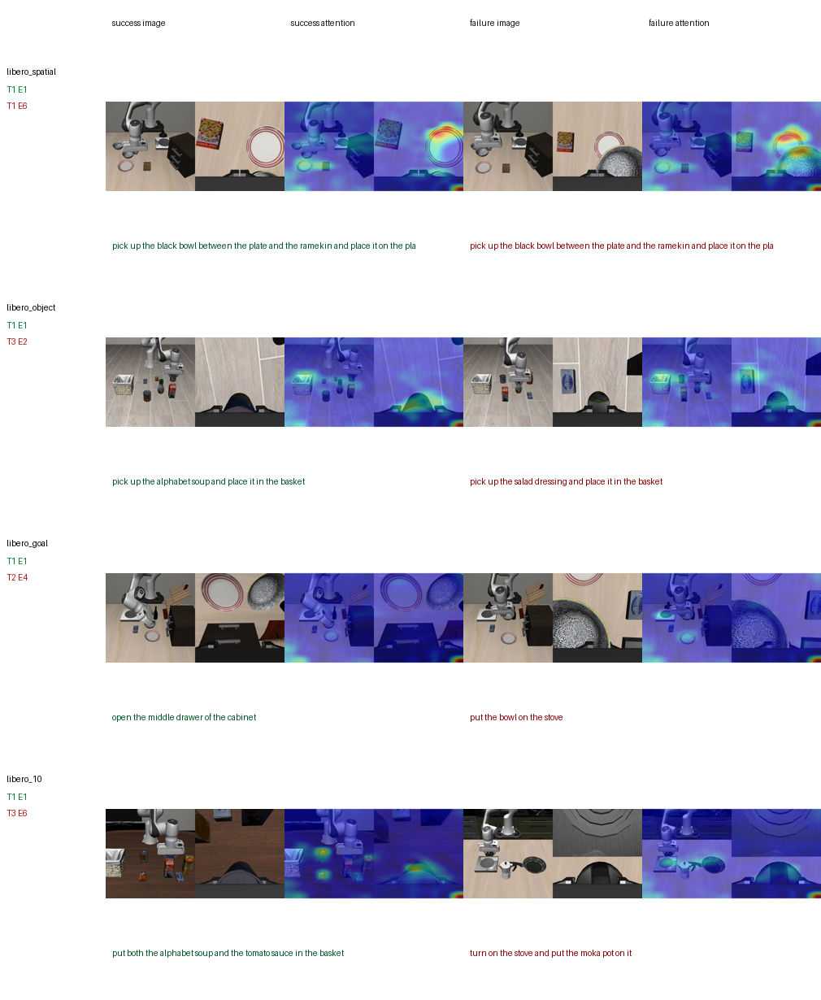
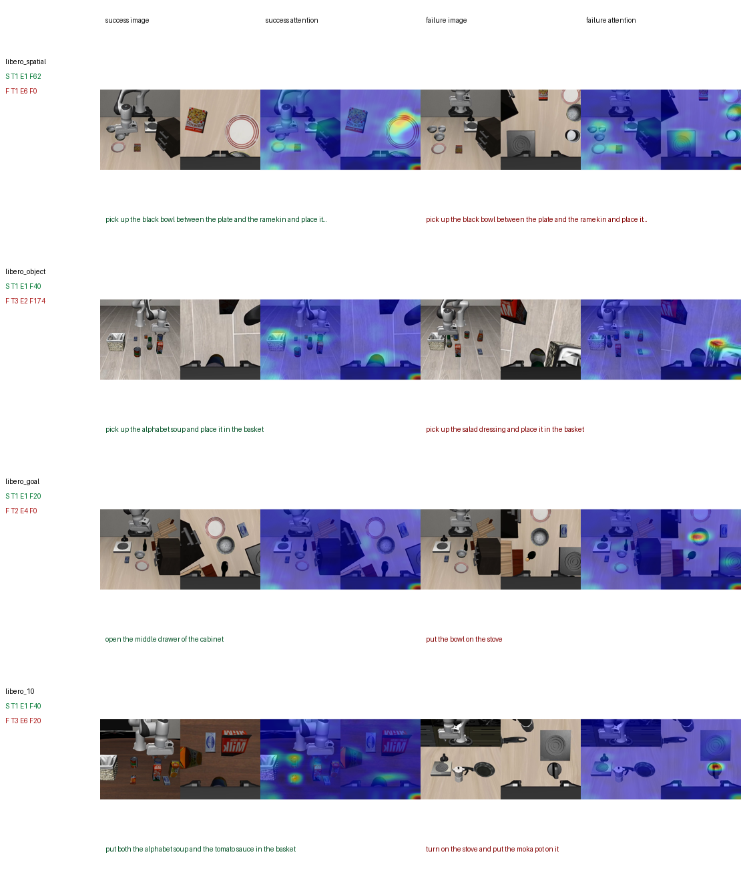
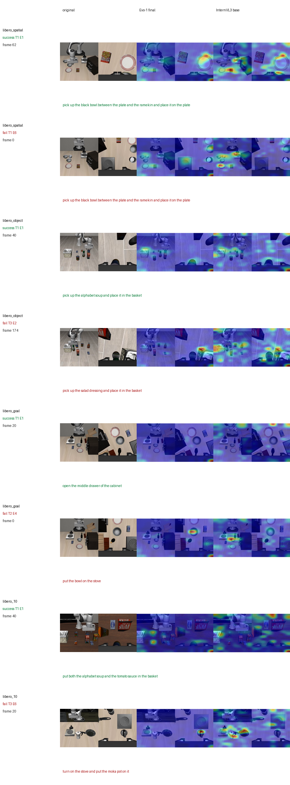

# Evo-1 LIBERO 复现实验报告

论文：**Evo-1: Lightweight Vision-Language-Action Model with Preserved Semantic Alignment**  
官方仓库：https://github.com/MINT-SJTU/Evo-1  
报告日期：2026-04-27

## 摘要

本报告复现 Evo-1 在 LIBERO 与 MetaWorld benchmark 上的推理表现，并基于 LIBERO rollout 视频分析其保留语言层的视觉-语言 attention。使用官方 `MINT-SJTU/Evo1_LIBERO` checkpoint，本地完成 3 个 seed 的 LIBERO 完整评估，共 `1200` 个 episodes，得到 `93.5% ± 1.3%` overall success rate，接近官方报告的 `94.8%`。使用官方 `MINT-SJTU/Evo1_MetaWorld` checkpoint，本地完成 MetaWorld MT50 `50 tasks x 10 episodes = 500 episodes` 评估，得到 `420/500 = 84.0%` raw success rate；按官方难度分组平均为 `80.7%`，与官方报告的 `80.6%` 基本一致。

在可解释性实验中，我们提取 Evo-1 截断 InternVL3 的第 14 层 attention，对应代码中的 `language_model.model.layers.13.self_attn`。结果显示，Evo-1 final checkpoint 能在任务相关区域形成较清晰的视觉关注；与未加载 Evo-1 checkpoint 的 InternVL3 base 相比，Evo-1 final 在选定样本上具有更高的 top-5 attention mass 和 focus score。

本报告不包含 OpenVLA / OpenVLA-OFT baseline，因此 Level 2 结论应理解为 semantic preservation probe，而不是原论文 Figure 2 的完整跨模型复刻。

---

## 1. 实验目标

Evo-1 关注轻量 VLA 在动作学习过程中的语义保持问题：模型需要学习连续控制，同时不显著破坏预训练 VLM 的视觉-语言对齐。围绕这一点，本地实验回答两个问题：

| 问题 | 对应实验 |
|---|---|
| Evo-1 官方 LIBERO checkpoint 是否能在本地接近官方成功率？ | Level 1：LIBERO 400 episodes 推理复现 |
| Evo-1 fine-tuned checkpoint 是否仍保留任务条件化视觉 attention？ | Level 2：layer 13 attention 可视化与 InternVL3 base 对照 |
| Evo-1 官方 MetaWorld checkpoint 是否能复现 MT50 难度分组成功率？ | Level 3：MetaWorld MT50 500 episodes 推理复现 |

---

## 2. 实验设置

### 2.1 环境

| 组件 | 配置 |
|---|---|
| 系统 | WSL `Ubuntu2204` |
| GPU | NVIDIA GeForce RTX 5070 Laptop GPU, 8 GB |
| Server env | Python 3.10, PyTorch `2.7.0+cu128`, Transformers `4.39.0`, FlashAttention `2.8.3` |
| Client env | Python 3.8.13, PyTorch `1.11.0+cu113`, robosuite `1.4.0`, mujoco `3.2.3` |
| LIBERO checkpoint | `MINT-SJTU/Evo1_LIBERO` |
| MetaWorld checkpoint | `MINT-SJTU/Evo1_MetaWorld` |
| VLM | `OpenGVLab/InternVL3-1B` local copy |
| Rendering | LIBERO 与 MetaWorld client 均使用 `MUJOCO_GL=osmesa` |

主要产物：

| 类型 | 路径 |
|---|---|
| Level 1 详细报告 | `Evo-1_reproduction/reports/LEVEL1_REPRODUCTION_REPORT.md` |
| Level 1 日志 | `Evo-1_reproduction/level1/log_file/` |
| Level 1 多 seed 汇总 | `Evo-1_reproduction/reports/level1_multiseed_summary.md` |
| Level 1 视频 | `Evo-1_reproduction/level1/video_log_file/Evo1_libero_all/` |
| Level 2 图与 CSV | `Evo-1_reproduction/figures/` |
| Level 3 日志 | `Evo-1_reproduction/level3_metaworld_mt50_10ep.log` |

### 2.2 Level 1 协议

评估覆盖 `libero_spatial`、`libero_object`、`libero_goal`、`libero_10` 四个 suite。每个 suite 10 个任务，每个任务 10 个 episode，单次完整评估为 400 个 episode。Evo-1 server 加载 LIBERO checkpoint，LIBERO client 发送多视角图像、机器人状态和语言指令，并执行 server 返回的 action chunk。正式报告采用 `seed=42/43/44` 三次完整评估，总计 1200 个 episode。

### 2.3 Level 2 协议

Level 2 使用 Level 1 的 rollout 视频，不重新运行仿真。流程为：

```text
rollout log + videos
        -> select success/failure cases
        -> sample frames
        -> run Evo-1 embedder with output_attentions=True
        -> extract layer 13 text-to-image attention
        -> save overlay and metrics
```

由于 FlashAttention 不返回普通 attention weights，attention probe 中关闭 FlashAttention。固定帧实验使用 `frame 30 / 60 / 90`；frame sweep 实验采样多个绝对帧和相对帧，并按如下指标选择展示帧：

```text
focus_score = top5_mass - 0.02 * entropy
```

### 2.4 Level 3 协议

MetaWorld 评估使用官方 `Evo1_MetaWorld` checkpoint，覆盖 MT50 全部 50 个任务。每个任务运行 10 个 episode，总计 500 个 episode。模型 server 与 Level 1 共用 Evo-1 推理环境，client 使用独立 `metaworld` 环境。WSL 下 `egl` 渲染存在不稳定问题，因此正式运行使用 `MUJOCO_GL=osmesa` 与 `PYOPENGL_PLATFORM=osmesa`。

---

## 3. Level 1：LIBERO 推理结果

| Suite | 本地复现 | 官方报告 |
|---|---:|---:|
| `libero_spatial` | 88/100 = 88.0% | 92.7% |
| `libero_object` | 97/100 = 97.0% | 97.7% |
| `libero_goal` | 94/100 = 94.0% | 96.3% |
| `libero_10` / long | 91/100 = 91.0% | 92.3% |
| Overall | **370/400 = 92.5%** | **94.8%** |

该表为 `seed=42` 的原始完整复现，与官方报告相差 `2.3` 个百分点。随后补充 `seed=43/44` 两次完整复跑，用于估计本地运行方差：

| Seed | Overall | `libero_spatial` | `libero_object` | `libero_goal` | `libero_10` |
|---:|---:|---:|---:|---:|---:|
| 42 | 370/400 = 92.5% | 88.0% | 97.0% | 94.0% | 91.0% |
| 43 | 380/400 = 95.0% | 93.0% | 98.0% | 95.0% | 94.0% |
| 44 | 372/400 = 93.0% | 86.0% | 97.0% | 96.0% | 93.0% |
| Mean ± std | **93.5% ± 1.3%** | 89.0% ± 3.6% | 97.3% ± 0.6% | 95.0% ± 1.0% | 92.7% ± 1.5% |

三次完整评估的均值与官方 `94.8%` 相差 `1.3` 个百分点，且官方结果落在本地均值的一个标准差附近。因此 Level 1 不只是单次跑通，而是具备了基本的重复运行稳定性。

平均步数：

| Suite | Average Steps |
|---|---:|
| `libero_spatial` | 7.40 |
| `libero_object` | 10.16 |
| `libero_goal` | 8.00 |
| `libero_10` | 18.50 |

主要失败来自空间关系任务和长指令组合任务。例如 `libero_spatial` Task 2 / Task 6 为 `7/10`，`libero_10` Task 7 / Task 8 为 `8/10`。

---

## 4. Level 2：Attention 可视化

### 4.1 固定帧分析

固定帧实验在每个 suite 中选取 success 和 fail 样本，并在同一帧索引上提取 layer 13 attention。`frame 60` 位于执行中段，通常比起始帧更能呈现目标物、容器和末端执行器之间的关系。



**图 1.** `frame 60` 的 success/failure attention 对比。每行对应一个 LIBERO suite；绿色为成功样本，红色为失败样本。

固定帧统计如下：

| Frame | Status | n | Max prob | Top-5 mass | Entropy |
|---:|---|---:|---:|---:|---:|
| 30 | success | 8 | 0.0446 | 0.1263 | 5.1427 |
| 30 | fail | 8 | 0.0385 | 0.1200 | 5.1704 |
| 60 | success | 8 | 0.0394 | 0.1261 | 5.1316 |
| 60 | fail | 8 | 0.0409 | 0.1205 | 5.1362 |
| 90 | success | 8 | 0.0405 | 0.1164 | 5.1681 |
| 90 | fail | 8 | 0.0395 | 0.1229 | 5.1524 |

固定帧的 success/fail 均值差异较小。该结果说明 attention probe 可稳定提供逐样本解释，但不足以单独支持“成功样本 attention 显著优于失败样本”的强结论。

### 4.2 Frame sweep 分析

不同任务的关键动作发生时间不同。Frame sweep 对每个 case 采样多个候选帧，并选取 focus score 最高的帧用于展示。



**图 2.** Frame sweep 自动选择的 success/failure attention 展示。该图比固定帧更适合定性分析，因为它允许不同任务在各自更清晰的阶段呈现 attention。

图中可观察到，Evo-1 attention 在多个成功样本中覆盖目标物、容器或任务相关区域。失败样本同样可能出现高集中度 attention，但其聚焦区域有时偏离任务关键对象，或受到末端执行器、近景遮挡和视角变化影响。

---

## 5. InternVL3 Base 对照

为评估 fine-tuning 后的语义保持，本报告比较 `Evo-1 final` 与 `InternVL3 base`：

```text
Evo-1 final:      load LIBERO fine-tuned checkpoint
InternVL3 base:   use the same InternVL3-1B backbone without Evo-1 checkpoint
```

该对照不等价于 OpenVLA baseline；它用于检验 Evo-1 fine-tuning 后是否仍保留并增强任务条件化视觉 grounding。



**图 3.** 同一批 frame 上的 `original / Evo-1 final / InternVL3 base` 对比。

8 个 best-by-case 样本的统计结果如下：

| Group | n | Evo-1 focus | Base focus | Delta focus | Evo-1 top-5 | Base top-5 | Delta top-5 |
|---|---:|---:|---:|---:|---:|---:|---:|
| success | 4 | 0.0355 | 0.0132 | +0.0224 | 0.1374 | 0.1140 | +0.0234 |
| fail | 4 | 0.0505 | 0.0127 | +0.0379 | 0.1521 | 0.1138 | +0.0383 |
| all | 8 | 0.0430 | 0.0129 | +0.0301 | 0.1447 | 0.1139 | +0.0308 |

在这些样本上，Evo-1 final 的 attention 比 InternVL3 base 更集中。该结果支持一个有限结论：LIBERO fine-tuning 没有抹去 InternVL3 的任务相关视觉响应，并在选定 rollout 帧上增强了任务条件化聚焦。

同时，fail 组也出现明显 focus 提升，说明 attention 集中并不等价于执行成功。失败仍可能由动作预测、时序决策、状态估计或局部错误 grounding 引起。

---

## 6. Level 3：MetaWorld MT50 结果

MetaWorld MT50 评估完成 50 个任务、每个任务 10 个 episode，总计 500 个 episode。原始成功率为 `420/500 = 84.0%`。按官方难度分组统计如下：

| Difficulty | 本地复现 | 官方报告 |
|---|---:|---:|
| easy | 89.3% | 89.2% |
| medium | 76.4% | - |
| hard | 75.0% | 77.2% |
| very hard | 82.0% | 79.2% |
| Difficulty average | **80.7%** | **80.6%** |

该结果与官方 MetaWorld average 基本一致。与 Level 1 类似，本结果来自单次完整评估，未做多 seed 均值。

低分任务如下：

| Task | Success |
|---|---:|
| `handle-pull-side-v3` | 1/10 |
| `reach-v3` | 2/10 |
| `soccer-v3` | 3/10 |
| `hammer-v3` | 4/10 |
| `pick-out-of-hole-v3` | 4/10 |
| `handle-pull-v3` | 5/10 |
| `pick-place-v3` | 5/10 |

这些任务主要涉及较精细的接触、拉取、拾取或目标接近行为。它们与 high-level 语义 grounding 不完全等价，更容易受到动作轨迹、接触动力学和初始状态采样影响。

---

## 7. 与论文主张的对应关系

| 论文关注点 | 本地证据 | 结论强度 |
|---|---|---|
| LIBERO 推理性能 | 3 seeds，1200 episodes，93.5% ± 1.3% overall | 强 |
| MetaWorld 推理性能 | 500 episodes，80.7% difficulty average | 强 |
| fine-tuned Evo-1 是否保留任务相关 attention | layer 13 overlay，固定帧与 frame sweep | 中 |
| fine-tuning 是否增强相对 base VLM 的视觉聚焦 | Evo-1 final vs InternVL3 base，8 个样本 | 中 |
| 跨 VLA baseline 对比 | 未纳入 OpenVLA / OpenVLA-OFT | 不声称 |

对应的英文结论可写为：

> We reproduce Evo-1 LIBERO inference over three complete seeds with a 93.5% +/- 1.3% overall success rate, close to the reported 94.8%. Attention probing on the retained InternVL3 layer indicates that Evo-1 final preserves task-conditioned visual grounding and yields more concentrated text-to-image attention than the unfine-tuned InternVL3 base on selected rollout frames. This analysis does not include the OpenVLA baseline and should be interpreted as a semantic preservation probe rather than a full reproduction of the original cross-model attention comparison.

在加入 MetaWorld 后，可扩展为：

> We further reproduce the MetaWorld MT50 benchmark with an 80.7% difficulty-averaged success rate, matching the reported 80.6%.

---

## 8. 局限性

1. Level 1 已补充 3 个 seed；Level 3 仍为单次完整评估，未报告多 seed 均值和方差。
2. Attention overlay 是解释性证据，不构成失败原因的因果证明。
3. 当前 baseline 为 InternVL3 base，不是 OpenVLA / OpenVLA-OFT。
4. 当前指标基于全图 attention 分布；若要得到更强量化结论，需要目标物、容器和末端执行器的 region mask。

---

## 9. 结论

本地实验复现了 Evo-1 在 LIBERO 和 MetaWorld 上的主要推理表现：LIBERO 三个完整 seed 的均值为 `93.5% ± 1.3%`，接近官方 `94.8%`；MetaWorld MT50 难度分组平均为 `80.7%`，与官方 `80.6%` 基本一致。Attention 分析显示，Evo-1 final 在选定 LIBERO rollout 帧上保持任务相关视觉 grounding，并相比 InternVL3 base 产生更集中的 text-to-image attention。

因此，本报告支持两个结论：第一，Evo-1 的两个主要仿真 benchmark 结果均可在本地复现；第二，已有 attention 证据与论文的 semantic preservation 叙事一致。由于未纳入 OpenVLA baseline，本文不主张完整复现原论文 Figure 2。
